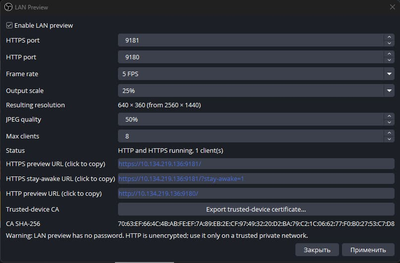

# LAN Preview for OBS Studio

[](https://github.com/maseaaao/obs-preview-plugin/actions/workflows/release.yml)
[](https://github.com/maseaaao/obs-preview-plugin/releases)
[](LICENSE)
[](#build)

LAN Preview is an independent third-party plugin for OBS Studio. It serves the current Program output to the local network as a live MJPEG preview.

Default preview URLs:

```text
https://<pc-lan-ip>:9181/
http://<pc-lan-ip>:9180/
```




## Highlights

- Live Program preview in any browser on the same local network.
- Simple MJPEG stream with snapshot and health endpoints.
- OBS menu entry at `Tools -> LAN Preview`.
- Windows x64 installer and portable release packages.
- No external service, account, or cloud dependency.

### [Demo](docs/demo.mp4)

## Install

Download the latest Windows assets from the [Releases](https://github.com/maseaaao/obs-preview-plugin/releases) page.

Use one of these packages:

- `obs-preview-plugin.windows-x64-installer.zip` - installer build.
- `obs-preview-plugin.windows-x64-portable.zip` - portable OBS folder layout.

The installer automatically detects both the regular OBS Studio installation and the Steam edition (including OBS installed in an additional Steam library). You can still change the target folder in the installer if needed.

For the portable package, extract the archive into the OBS Studio installation directory so `obs-plugins\64bit\obs-lan-preview.dll` lands under the OBS root.

## Use

1. Install the plugin into OBS.
2. Open OBS.
3. Go to `Tools -> LAN Preview`.
4. Enable preview and apply settings.
5. Open the shown HTTP URL for an immediate, unencrypted preview; or export the trusted-device certificate, install it on each phone/tablet, then open the HTTPS URL.

After updating from a release before 0.2.1, export and trust the new LAN Preview certificate again before using HTTPS. The certificate identity was changed as part of the product rebrand.

The certificate fingerprint displayed by the plugin lets you verify the file before trusting it. The plugin creates a stable local CA for this OBS user; it is not a public Internet certificate.

For repeatable TLS, mobile, PWA, and performance acceptance checks, see [Mobile Validation](docs/mobile-validation.md).

Click any URL in the settings dialog to copy it. The regular HTTP and HTTPS URLs show the preview. The HTTPS **Stay-awake URL** adds `?stay-awake=1` and asks compatible browsers to keep the screen on while the page is visible.

On Android, use the browser install option; on iPhone and iPad, use Safari **Share → Add to Home Screen**. These PWA features require the HTTPS URL; the HTTP URL is for direct browser viewing.

Windows Firewall may ask whether OBS can accept local network connections. Allow private networks if you want phone or tablet access.

## Default Settings

- 5 FPS
- 33% of the OBS output resolution
- JPEG quality 70%
- Bind address `0.0.0.0`
- HTTPS port `9181`; HTTP port `9180`
- No password in v1

## Performance Checks

The plugin captures, JPEG-encodes, and serves frames over HTTP and HTTPS, so it does extra work beyond the built-in OBS preview. See [Performance Measurement](docs/performance-measurement.md) for the repeatable measurement script and comparison protocol.

## HTTP and HTTPS Endpoints

- `/` - browser page with the live preview (installable over HTTPS)
- `/preview.mjpg` - MJPEG stream
- `/snapshot.jpg` - latest JPEG frame
- `/health` - JSON status

The browser page stops its MJPEG connection when it is actually hidden (`visibilitychange`) and reconnects when visible again. A split-screen preview remains connected because it is still visible.

## Security

The plugin intentionally has no password. Anyone on the same network can view the preview while it is enabled. HTTP is unencrypted. HTTPS encrypts the transport after the device trusts the exported local CA; it does not add access control.

Use it only on trusted private networks. See [SECURITY.md](SECURITY.md) for reporting guidance.

## Build

Requirements:

- Windows 10/11
- OBS Studio 32.x development files available to CMake
- Visual Studio 2022
- CMake 3.28+
- Qt6 matching the OBS build environment
- Inno Setup 6

Install the free command-line tooling with:

```powershell
Set-ExecutionPolicy -Scope Process Bypass
.\scripts\setup-windows-dev.ps1
```

Configure and build:

```powershell
& "C:\Program Files\CMake\bin\cmake.exe" --preset windows-x64 `
  "-DCMAKE_PREFIX_PATH=C:/obs-dev/obs-prefix;C:/obs-dev/obs-studio-32.1.2/.deps/obs-deps-2025-08-23-x64;C:/obs-dev/obs-studio-32.1.2/.deps/obs-deps-qt6-2025-08-23-x64"

cmake --build --preset windows-x64-release --parallel
cmake --install build/windows-x64 --config Release
```

The plugin binary is `obs-lan-preview.dll`.

Build both release zip assets:

```powershell
.\scripts\package-windows.ps1
```

For a packaging-only iteration after a successful build, use
`.\scripts\package-windows.ps1 -SkipBuild`. The release workflow caches the
pinned OBS development prefix and dependencies; a cache hit skips the OBS
clone and build, while every run still builds and packages the plugin itself.
The packaging script builds with all available cores by default; pass
`-Parallel 4` to cap it.

This creates:

```text
release\packages\obs-preview-plugin.windows-x64-installer.zip
release\packages\obs-preview-plugin.windows-x64-portable.zip
```

## OBS Development Prefix

The regular OBS Studio installation usually does not include `libobsConfig.cmake`.
Build and install only the development pieces from OBS source:

```powershell
cd C:\obs-dev\obs-studio-32.1.2

"C:\Program Files\CMake\bin\cmake.exe" --preset windows-x64 `
  -DCMAKE_INSTALL_PREFIX=C:/obs-dev/obs-prefix

"C:\Program Files\CMake\bin\cmake.exe" --build --preset windows-x64 --config RelWithDebInfo --target libobs obs-frontend-api
"C:\Program Files\CMake\bin\cmake.exe" --install build_x64 --prefix C:\obs-dev\obs-prefix --config RelWithDebInfo --component Development
```

This avoids building the full OBS application and plugins.

## Versioning and Releases

Use SemVer bumps:

```powershell
.\scripts\bump-version.ps1 patch
.\scripts\bump-version.ps1 minor
.\scripts\bump-version.ps1 major
```

The bump script updates `VERSION`, `CMakeLists.txt`, and the Inno Setup script, then creates a commit and tag like `v0.1.1`.

Push the tag to trigger GitHub Releases:

```powershell
git push
git push --tags
```

The GitHub Actions release workflow uploads:

```text
obs-preview-plugin.windows-x64-installer.zip
obs-preview-plugin.windows-x64-portable.zip
```

It also generates release notes from non-merge commits since the previous tag, with each commit subject linked to its GitHub commit.

For manual publishing with GitHub CLI:

```powershell
.\scripts\package-windows.ps1
.\scripts\publish-github-release.ps1
```

## Contributing

Issues and pull requests are welcome. See [CONTRIBUTING.md](CONTRIBUTING.md), [SUPPORT.md](SUPPORT.md), and [CODE_OF_CONDUCT.md](CODE_OF_CONDUCT.md).

## License

Copyright (C) 2026 maseaaao and maxxborer contributors.

LAN Preview is free software: you can redistribute it and/or modify it under the terms of the [GNU General Public License](LICENSE) as published by the Free Software Foundation, either version 2 of the License, or (at your option) any later version.

## Links

[OBS Forum](https://obsproject.com/forum/resources/lan-preview-for-obs-studio.2590/)
